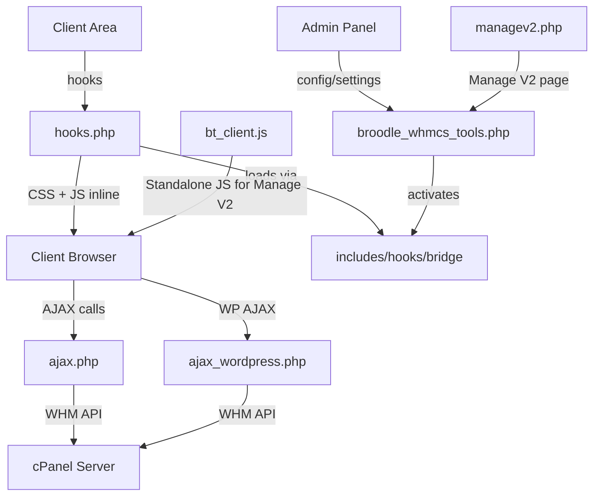

# Broodle WHMCS Tools — Module Walkthrough

## Overview

**Broodle WHMCS Tools** (v3.10.76) is a WHMCS addon module that replaces the default cPanel product details page with a custom tabbed UI. It communicates with cPanel servers via WHM API to provide clients direct management capabilities from within WHMCS.

> [!IMPORTANT]
> The module is designed for **WHMCS 9.x + PHP 8.1+ + Lagom/Lagom2 theme** and specifically targets **cPanel hosting products**.

---

## Architecture

---

## File Structure

| File | Size | Purpose |
|------|------|---------|
| [broodle_whmcs_tools.php](file:///c:/Users/Broodle/Desktop/broodle-tools-whmcs/modules/addons/broodle_whmcs_tools/broodle_whmcs_tools.php) | 846 lines | **Main module** — config, activate/deactivate, admin UI, auto-updater |
| [hooks.php](file:///c:/Users/Broodle/Desktop/broodle-tools-whmcs/modules/addons/broodle_whmcs_tools/hooks.php) | 2946 lines | **Client-area UI** — all hooks, CSS, inline JS, tab builder, modals |
| [ajax.php](file:///c:/Users/Broodle/Desktop/broodle-tools-whmcs/modules/addons/broodle_whmcs_tools/ajax.php) | 2267 lines | **AJAX API** — email, domain, DB, SSL, DNS, cron, PHP, logs, file manager |
| [ajax_wordpress.php](file:///c:/Users/Broodle/Desktop/broodle-tools-whmcs/modules/addons/broodle_whmcs_tools/ajax_wordpress.php) | ~47KB | **WordPress AJAX** — WP site detection, plugins, themes, security |
| [ajax_filemanager.php](file:///c:/Users/Broodle/Desktop/broodle-tools-whmcs/modules/addons/broodle_whmcs_tools/ajax_filemanager.php) | ~23KB | **File Manager AJAX** — browse, edit, upload, compress, extract |
| [bt_client.js](file:///c:/Users/Broodle/Desktop/broodle-tools-whmcs/modules/addons/broodle_whmcs_tools/bt_client.js) | ~312KB | **Standalone JS** — used by Manage V2 page (full client-side app) |
| [managev2.php](file:///c:/Users/Broodle/Desktop/broodle-tools-whmcs/modules/addons/broodle_whmcs_tools/managev2.php) | ~3KB | **Manage V2 bootstrap** — alternative full-page management view |
| [templates/managev2.tpl](file:///c:/Users/Broodle/Desktop/broodle-tools-whmcs/modules/addons/broodle_whmcs_tools/templates/managev2.tpl) | 143B | Smarty template for Manage V2 |
| [templates/error.tpl](file:///c:/Users/Broodle/Desktop/broodle-tools-whmcs/modules/addons/broodle_whmcs_tools/templates/error.tpl) | 161B | Error template |
| [lang/english.php](file:///c:/Users/Broodle/Desktop/broodle-tools-whmcs/modules/addons/broodle_whmcs_tools/lang/english.php) | ~4KB | Language strings |
| [includes/hooks/broodle_whmcs_tools.php](file:///c:/Users/Broodle/Desktop/broodle-tools-whmcs/includes/hooks/broodle_whmcs_tools.php) | 20 lines | **Bridge hook** — ensures hooks.php loads on every request |

---

## Features (Toggle-able via Admin)

| Setting Key | Feature | Default |
|------------|---------|---------|
| `tweak_nameservers_tab` | Nameservers accordion in Overview | ✅ ON |
| `tweak_email_list` | Email Accounts tab (CRUD + webmail login) | ✅ ON |
| `tweak_wordpress_toolkit` | WordPress tab (plugins, themes, security, auto-login) | ❌ OFF |
| `tweak_domain_management` | Domains tab (addon/sub/parked CRUD) | ✅ ON |
| `tweak_database_management` | Databases tab (MySQL CRUD, phpMyAdmin, user privileges) | ✅ ON |
| `tweak_ssl_management` | SSL tab (cert status, expiry, AutoSSL) | ✅ ON |
| `tweak_dns_management` | DNS Manager tab (full zone CRUD, bulk delete) | ✅ ON |
| `tweak_cron_management` | Cron Jobs tab (CRUD with presets) | ✅ ON |
| `tweak_php_version` | PHP Version tab (view/switch per domain) | ✅ ON |
| `tweak_error_logs` | Error Logs tab (live log viewer, auto-refresh) | ✅ ON |
| `tweak_file_manager` | File Manager (sidebar, browse/edit/upload/compress) | ✅ ON |
| `tweak_upgrade_list_layout` | Upgrade page: grid → list layout | ❌ OFF |
| `auto_update_enabled` | GitHub auto-update checking | ❌ OFF |

---

## Key Components Deep Dive

### 1. Main Module ([broodle_whmcs_tools.php](file:///c:/Users/Broodle/Desktop/broodle-tools-whmcs/modules/addons/broodle_whmcs_tools/broodle_whmcs_tools.php))

- **[broodle_whmcs_tools_config()](file:///c:/Users/Broodle/Desktop/broodle-tools-whmcs/modules/addons/broodle_whmcs_tools/broodle_whmcs_tools.php#24-38)** — Module metadata
- **[broodle_whmcs_tools_activate()](file:///c:/Users/Broodle/Desktop/broodle-tools-whmcs/modules/addons/broodle_whmcs_tools/broodle_whmcs_tools.php#39-97)** — Creates `mod_broodle_tools_settings` table, inserts defaults, installs bridge hook + managev2 page
- **[broodle_whmcs_tools_deactivate()](file:///c:/Users/Broodle/Desktop/broodle-tools-whmcs/modules/addons/broodle_whmcs_tools/broodle_whmcs_tools.php#98-123)** — Drops settings table, removes bridge hook + managev2
- **[broodle_whmcs_tools_output()](file:///c:/Users/Broodle/Desktop/broodle-tools-whmcs/modules/addons/broodle_whmcs_tools/broodle_whmcs_tools.php#196-270)** — Admin settings page (toggle switches, update checker)
- **[broodle_whmcs_tools_clientarea()](file:///c:/Users/Broodle/Desktop/broodle-tools-whmcs/modules/addons/broodle_whmcs_tools/broodle_whmcs_tools.php#124-195)** — Client-side Manage V2 page entry point
- **Auto-updater** — Checks GitHub releases API, downloads zip, extracts to module dir

### 2. Hooks & Client UI ([hooks.php](file:///c:/Users/Broodle/Desktop/broodle-tools-whmcs/modules/addons/broodle_whmcs_tools/hooks.php))

This is the **largest and most complex file**. It contains:

- **Helper functions** (lines 26-151) — Setting checks, cPanel service lookup, nameserver/email/domain data fetching
- **[broodle_tools_gather_data()](file:///c:/Users/Broodle/Desktop/broodle-tools-whmcs/modules/addons/broodle_whmcs_tools/hooks.php#243-384)** (lines 243-383) — Central data collection: service info, billing, limits, all enabled features
- **WHMCS Hooks:**
  - `ClientAreaProductDetailsOutput` — Injects "Manage V2" button
  - `ClientAreaPrimarySidebar` — Removes webmail, adds "Manage V2" sidebar link, adds File Manager link
- **CSS functions** (lines 494-1113) — Full styling: tabs, cards, modals, WordPress panel, DNS, dark mode (Lagom compatible), responsive
- **Inline JavaScript** (lines 1117-2946) — Complete SPA-like client app:
  - Tab system (Overview, Domains, SSL, Email, Databases, DNS, Cron, PHP, Error Logs)
  - Modal management (create/edit/delete email, domain, database)
  - AJAX operations for all features
  - WordPress panel with plugin/theme/security management
  - Copy-to-clipboard, accordion, carousel for addons
  - Lazy loading for expensive tabs (databases, SSL, DNS, cron, PHP, logs)

### 3. AJAX API ([ajax.php](file:///c:/Users/Broodle/Desktop/broodle-tools-whmcs/modules/addons/broodle_whmcs_tools/ajax.php))

All operations are **authenticated** (client must be logged in) and **authorized** (service must belong to client). Each action checks the corresponding feature toggle.

**Actions handled:**
- **Email**: `create_email`, `change_password`, `delete_email`, `webmail_login`
- **Domains**: [get_domains](file:///c:/Users/Broodle/Desktop/broodle-tools-whmcs/modules/addons/broodle_whmcs_tools/hooks.php#187-229), `get_parent_domains`, `add_addon_domain`, `add_subdomain`, `delete_domain`
- **Databases**: `list_databases`, `create_database`, `create_db_user`, `delete_database`, `delete_db_user`, `assign_db_user`, `get_phpmyadmin_url`
- **SSL**: `ssl_status`, `start_autossl`, `autossl_progress`, `autossl_problems`
- **DNS**: `dns_list_domains`, `dns_fetch_records`, `dns_add_record`, `dns_edit_record`, `dns_delete_record`, `dns_bulk_delete`
- **Cron**: `cron_list`, `cron_add`, `cron_edit`, `cron_delete`
- **PHP**: `php_get_versions`, `php_set_version`
- **Logs**: `error_log_read`
- **File Manager**: `fm_list`, `fm_read`, `fm_save`, `fm_create_file`, `fm_create_folder`, `fm_delete`, `fm_rename`, `fm_copy`, `fm_move`, `fm_upload`, `fm_permissions`, `fm_compress`, `fm_extract`, `fm_search`, `fm_download_url`
- **Addons**: `get_addon_description`, `get_addons`
- **Resources**: `cpanel_resource_stats` (CPU, Memory, I/O, Processes via 3 strategies)
- **SSO**: `get_cpanel_sso_url` (cPanel single sign-on)

### 4. Server Authentication Pattern

All cPanel communication uses WHM API with this auth priority:
1. **API Token** (`accesshash` field) — preferred, validated as alphanumeric 10-64 chars
2. **Password** (`password` field, WHMCS-encrypted) — fallback
3. Headers: `Authorization: whm {serverUser}:{accessHash}` or HTTP basic auth

---

## Database

Single table: **`mod_broodle_tools_settings`**

| Column | Type |
|--------|------|
| [id](file:///c:/Users/Broodle/Desktop/broodle-tools-whmcs/modules/addons/broodle_whmcs_tools/hooks.php#494-504) | INT AUTO_INCREMENT |
| `setting_key` | VARCHAR(255) UNIQUE |
| `setting_value` | TEXT NULLABLE |
| `created_at` | TIMESTAMP |
| `updated_at` | TIMESTAMP |

---

## How It Works (Client Flow)

1. Client visits product details page → bridge hook loads [hooks.php](file:///c:/Users/Broodle/Desktop/broodle-tools-whmcs/modules/addons/broodle_whmcs_tools/hooks.php)
2. `ClientAreaProductDetailsOutput` hook fires → gathers cPanel data via WHM API
3. **Hides** default WHMCS tabs/panels (cPanel overview, webmail, addons sections)
4. **Injects** custom tabbed UI with inline CSS + JS as hook output
5. Tabs load content: Overview shows billing+server info, other tabs load on click via lazy AJAX
6. All management actions (CRUD) go through [ajax.php](file:///c:/Users/Broodle/Desktop/broodle-tools-whmcs/modules/addons/broodle_whmcs_tools/ajax.php) → WHM API → cPanel server

---

## What Changes Would You Like to Make?

Now that I've documented the full module structure, please let me know what specific modifications you'd like to make. Some examples:
- Add a new tab/feature
- Modify an existing tab's behavior
- Change the UI/styling
- Add/remove a setting toggle
- Fix a bug
- Refactor code structure
